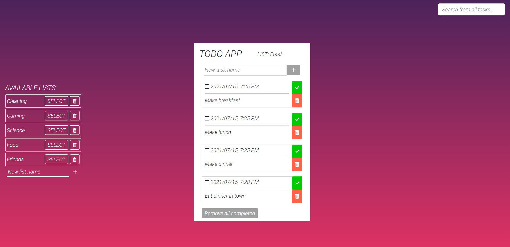

# ToDoApp

User Interface for https://github.com/igor-on/ToDo-rest-api 

## TABLE OF CONTENTS

* [Screenshot from app](#screenshot-from-app)
* [Progress](#progress)
* [Purpose of the application](#purpose-of-the-application)
* [How to start](#how-to-start)
* [Technologies](#technologies)
* [Further help](#further-help)

## Screenshot from app 

## Progress 

:heavy_check_mark::heavy_check_mark::heavy_check_mark::heavy_check_mark::heavy_check_mark::heavy_check_mark::heavy_check_mark::heavy_check_mark::heavy_check_mark::heavy_check_mark: - 100%

## Purpose of the application

I made this application to train basic concepts of Angular

### What you can do in this app?

* Write tasks that have to be done
* Group your tasks by adding them to specific list/category
* Search for tasks and filter them
* Mark finished tasks as completed
* Once you have some tasks completed, delete them one by one or with prepared 'remove all completed' button

## How to start 

 * First you have to make sure you run this(https://github.com/igor-on/ToDo-rest-api) on your computer
 * To install all needed node_modules use the command `npm ci` on the command line from this application directory
 * Then run `ng serve` for a dev server. Navigate to `http://localhost:4200/` where the application will run

 ## Technologies 

#### This project was generated with [Angular CLI](https://github.com/angular/angular-cli) version 11.2.5.
 
## Further help

To get more help on the Angular CLI use `ng help` or go check out the [Angular CLI Overview and Command Reference](https://angular.io/cli) page.
